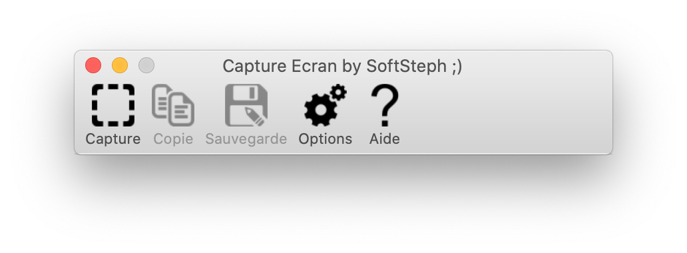

# Xojo-CaptureEcran
Xojo Capture Screen for MacOs and Windows

Fonctionnalites :
- Capture d'image par trace d'un rectangle sur l'ecran
- Indication de la taille de la selection en pixels
- Sauvegarde possible de l'image sur le Bureau ainsi que dans le ClipBoard
- Incrementation des Sauvegardes automatiques
- Fonctionne sur Windows et MacOs 64 bits

