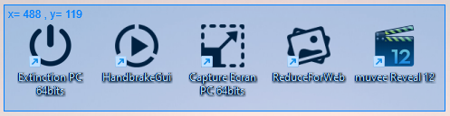

# Xojo-CaptureEcran
Xojo Capture Screen for MacOs and Windows

Fonctionnalites :
- Capture d'image par trace d'un rectangle sur l'ecran
- Indication de la taille de la selection en pixels
- Sauvegarde possible de l'image sur le Bureau ainsi que dans le ClipBoard
- Incrementation des Sauvegardes automatiques
- Fonctionne sur Windows et MacOs 64 bits
- Aide animee (GIF)
- Sauvegarde au format Jpg ou Png
- Sauvegarde des options

Si vous aimez mes programmes, <a href="https://www.paypal.com/donate/?hosted_button_id=GY5LTDDPZ2HZG"> vous pouvez faire un don PayPal ;)</a>

Historique des versions :

v0.24 du 20/08/2022
Corection d'un bug sous Windows lié à mise à l'échelle de Windows

v.023 du 14/07/2022
Correction de bugs sous Windows et MacOs

v0.22 du 11/10/2020
Gestion de l'échelle d'affichage sous Windows (100%/125%/150%)

v0.21 du 10/10/2020
Fenêtre d'aide qui s'ouvre au premier démarrage ou par le biais du menu

v0.20 du 05/10/2020
Remplacement des Icones de menu via Canvas par une vraie Toolbox
Ajout d'une icône option
Changement des icônes
Correction d'un bug lors de l'appui de la touche Echap qui empêchait de voir la fenêtre principale
Correction d'un bug lié aux FilesTypes sous Windows
Choix entre sauvegarde Jpg ou Png
Sauvegarde des Options

v0.19 du 05/09/2020
Barre de Menu horizontale au lieu de verticale

v0.18 du 28/04/2020
Ecran d'explication au lancement de la capture

v.017 du 19/01/2020
Clarification du Code - Premiere version GitHub

v.016 du 19/01/2020
Enregistrement de la position de la fenetre principale

v.015 du 19/01/2020
Nouveau Design

v.014 du 18/01/2020
Premiere version MacOs Publique

v.013 du 17/01/2020
DŽbugage sous Windows

v.012 du 17/01/2020
Automatisation des sauvegardes (non retenu)

v.011 du 17/01/2020
Incrementation automatique des sauvegardes

v.010 du 17/01/2020
Clipboard Windows

v.09 du 17/01/2020
Premiere version Publique fonctionnelle
